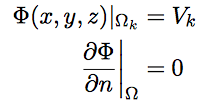

---  
layout: default  
category: info  
title: ThisisaTest  
---

{{page.title}}
==============

This demo hopes to include all possible functions necessary for the
documentation of SCIRun. Including but not limited to referencing
[figures](#readfield), [equations](#equation), [sections](#graphics),
and inline \(\theta\)

Graphics
--------

<figure id="eqn26">

<figcaption>
(2.6)
</figcaption>
</figure>

$$\frac{\partial\Phi}{\partial n}\bar_\Omega = 0$$

$$y(p,t) = \int_{x} \mathbf{A}_{p,x}u(t-\tau(x))\,dx$$

$$\Theta$$

And now I need many lines to see if the anchors actually work

And now I need many lines to see if the anchors actually work

And now I need many lines to see if the anchors actually work

And now I need many lines to see if the anchors actually work

And now I need many lines to see if the anchors actually work

And now I need many lines to see if the anchors actually work

And now I need many lines to see if the anchors actually work

And now I need many lines to see if the anchors actually work

And now I need many lines to see if the anchors actually work

And now I need many lines to see if the anchors actually work

And now I need many lines to see if the anchors actually work

And now I need many lines to see if the anchors actually work

And now I need many lines to see if the anchors actually work

And now I need many lines to see if the anchors actually work

And now I need many lines to see if the anchors actually work

And now I need many lines to see if the anchors actually work

And now I need many lines to see if the anchors actually work

And now I need many lines to see if the anchors actually work

And now I need many lines to see if the anchors actually work

And now I need many lines to see if the anchors actually work

And now I need many lines to see if the anchors actually work

And now I need many lines to see if the anchors actually work

And now I need many lines to see if the anchors actually work

And now I need many lines to see if the anchors actually work And now I
need many lines to see if the anchors actually work And now I need many
lines to see if the anchors actually work And now I need many lines to
see if the anchors actually work And now I need many lines to see if the
anchors actually work And now I need many lines to see if the anchors
actually work And now I need many lines to see if the anchors actually
work And now I need many lines to see if the anchors actually work And
now I need many lines to see if the anchors actually work And now I need
many lines to see if the anchors actually work And now I need many lines
to see if the anchors actually work

This demo hopes to include all possible functions necessary for the
documentation of SCIRun. Including but not limited to referencing
[figures](#readfield), [equations](#equation), [sections](#graphics),
and inline
