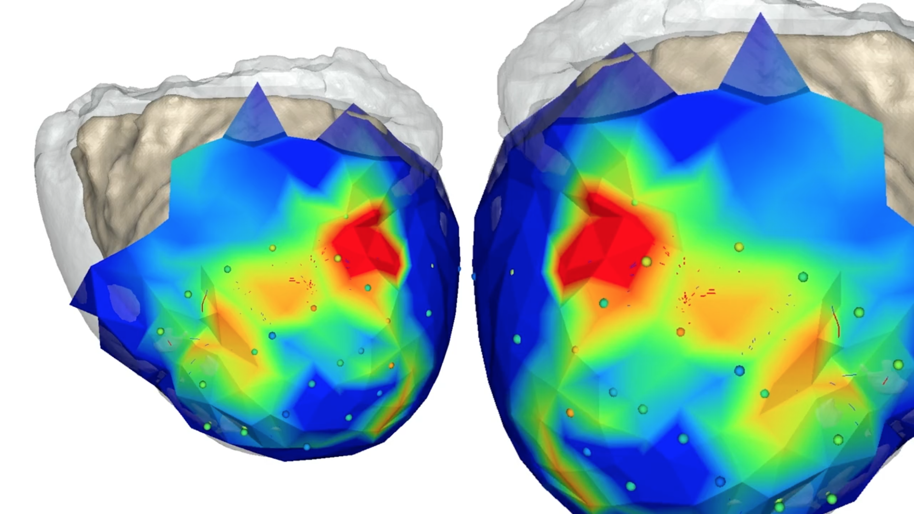
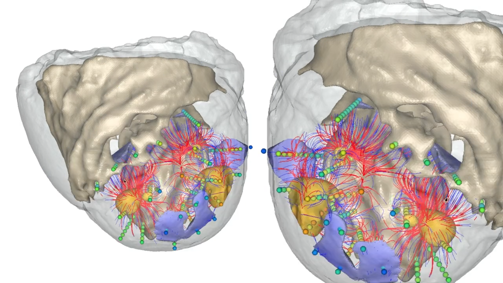

<html>
  <head>
    <link href="https://maxcdn.bootstrapcdn.com/bootstrap/4.4.1/css/bootstrap.min.css" rel="stylesheet">
    
    
    <link rel="stylesheet" href="{{ site.baseurl }}/css/index.css">
  </head>
  <body>
    

      <!-- Indicators -->
      <ol class="carousel-indicators">
        <li data-target="#myCarousel" data-slide-to="0" class="active"></li>
        <li data-target="#myCarousel" data-slide-to="1"></li>
        <li data-target="#myCarousel" data-slide-to="2"></li>
      </ol>

      <!-- Wrapper for slides -->
      

        

          
        

        

          
        

        

          
        

      

      <!-- Left and right controls -->
      <a class="carousel-control-prev" href="#myCarousel" data-slide="prev">
        
        Previous
      </a>
      <a class="carousel-control-next" href="#myCarousel" data-slide="next">
        
        Next
      </a>
    

  </body>
</html>

<!--  -->

### SCIRun 5.0

[SCIRun](https://github.com/SCIInstitute/SCIRun) is a problem solving environment developed by the NIH Center for Integrative Biomedical Computing at the University of Utah Scientific Computing and Imaging (SCI) Institute.

SCIRun 5 is a complete rewrite of the GUI front end and graphical components of SCIRun 4, including a more stable and efficient middle layer, with support for Python scripting.

*Warning! SCIRun 5 is beta software, you may use for real science but beware of instability.*

- [Build](build.html)
- [Module Reference](modules.html)
- [Python API 0.2](python.html)
- [Basic Tutorial](BasicTutorial.html)
- [SCIRun5 Module Generation](SCIRun5ModuleGeneration.html)

Doc v1.0c
 - [Build](build.html)
 - [Module Reference](modules.html)
 - [Python API 0.2](python.html)
 - [Basic Tutorial](BasicTutorial.html)
 - [SCIRun5 Module Generation](SCIRun5ModuleGeneration.html)
